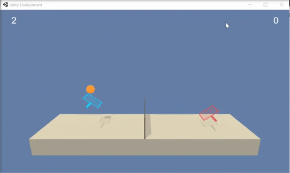
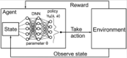
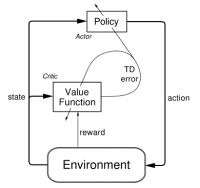
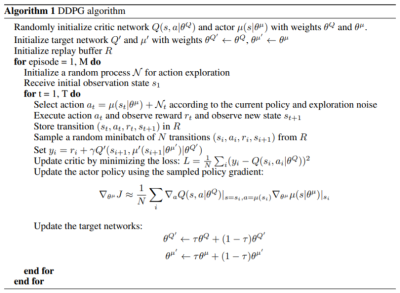
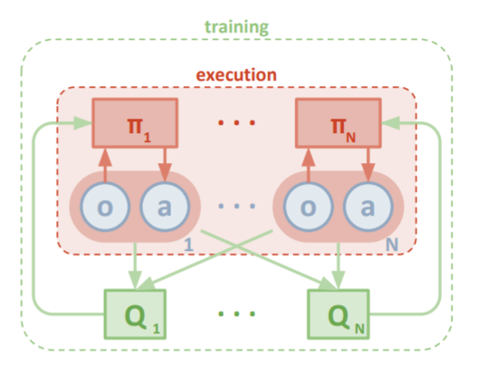
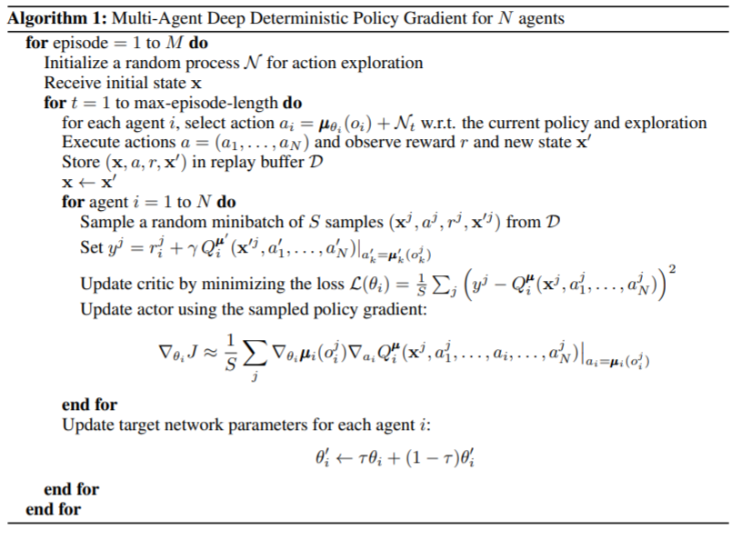
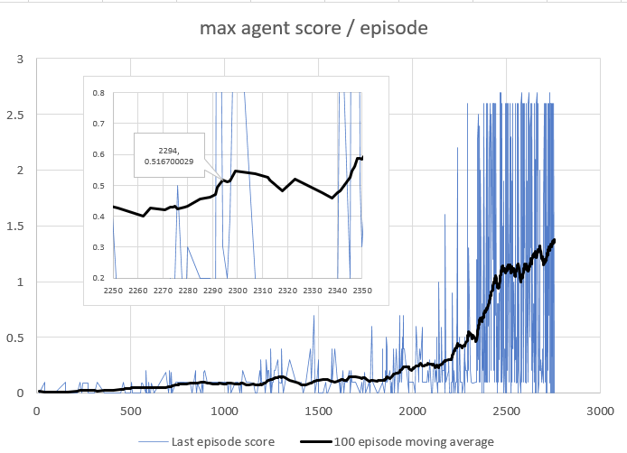
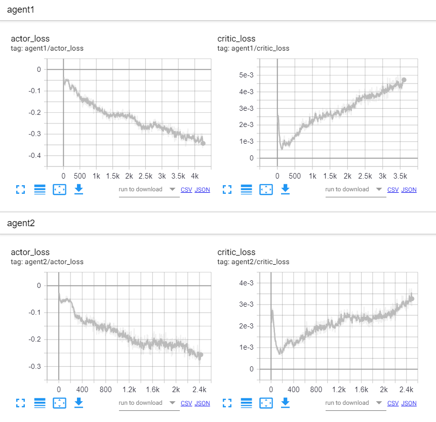

# Tennis Unity environment solution Report
# Udacity Reinforcement Learning Nanodegree Project 3: Collaboration and Competition

This project implements a multi-agent DDPG to learn two agents how to collaborate and play Tennis.

## Environment particularities
<p align="center">
  
</p>

In this environment, two agents control rackets to bounce a ball over a net. If an agent hits the ball over the net, it receives a reward of +0.1.  If an agent lets a ball hit the ground or hits the ball out of bounds, it receives a reward of -0.01.  Thus, the goal of each agent is to keep the ball in play.

The observation space consists of 8 variables corresponding to the position and velocity of the ball and racket. Each agent receives its own, local observation which consists of the last 3 observations concatenated.  Two continuous actions are available, corresponding to movement toward (or away from) the net, and jumping. 

The task is episodic, and in order to solve the environment, the agents must get an average score of +0.5 (over 100 consecutive episodes, after taking the maximum over both agents).

## Reinforcement Learning and Policy Gradient methods background

Reinforcement learning (RL) is one of the three basic machine learning paradigms, together with supervised learning and unsupervised learning. Whereas both supervised and unsupervised learning are concerned with finding an accurate system to predict an output given inputs, RL focuses on Markov Decision Processes (MDPs) and is concerned with the transition from states to states and the reward/cost associated with these transitions.  
This environment/agent interaction is depicted in below figure:
<p align="center">
  
</p>


Basically, the agent and environment interact in a sequence of discrete time steps t. At each time step t, the agent receives some representation of the environment's state, S<sub>t</sub>&#8712;S, and on that basis selects an action, A<sub>t</sub>&#8712;A(S). At the next timestep t+1, in part as a consequence of its action, the agent receives a scalar reward, R<sub>t+1</sub>&#8712;&#8477;, as well as an new state S<sub>t+1</sub>. The MDP and agent together create a trajectory from an initial time step t over n transitions of states,actions,rewards, and next states as follows:


We represent the sum of rewards accumulated over a trajectory as . Clearly the limit of G<sub>t</sub> as the trajectory steps n increase is unbounded, so to make sure that we can have a bounded maximum total reward, we discount the rewards from the next transaction by a factor &gamma;&#8712;(0,1] with the case of γ=1 being useful only when a task is episodic, ie with a fixed number of transitions.
In the case that the sets S,R,and A are finite, then the MDP is finite and the following hold:
* Random variables  have well defined discrete probability distributions **depending only on the preceding state  & action **
* Given a random state s' ∈ S and reward r ∈ R the probability of s' and r occuring at time t given a preceding state s and action a is given by the four argument MDP <strong>dynamics function</strong> 
  
* Namely, given a state s and an action a, a probability can be assigned to reaching a state s' and receiving reward r, however the sum of these probabilities over all the possible next states and rewards is 1. That is:
  * 

From the <em>dynamics</em> function <em>**p**</em> we can derive other useful functions:
* <em>state transition probabilities</em> : 
* <em>expected rewards</em>: 

We define a policy, ), as a function  that produces an action a given a state s. Thus the expected rewards at a state s can be expressed as =r(s,\pi(s))=\mathbb{E}[R_t|S_{t-1}=s,A_{t-1}=\pi(s)]). This allows us to define the action-value function ), which defines the value of taking action a in state s under the policy π, and continuing the trajectory by taking following the policy π as follows:

[comment]: <> (%2B is plus sign)
[comment]: <> (%0A is line feed, %26 is &)


A fundamental property of the action value function is that it satisfies recursive relationships. That is, for any policy  and any state , the following consistency holds between the action value of ) and the action value of ():


The sum of probabilities over all possible next states s' and rewards r reflects the stochastisticy of the system. If we focus on a specific time-step t, then we can reformulate this with bootstrapping as follows:


When  is approximated as a non-linear function with a neural network with parameters θ, then we denote the action-value function as .
### Q - learning
In Q-learning, we consider that π is an optimal policy, that selects the next action based on the maximum q value of the future state. We learn the parameters of  through gradient descent, trying to fit the above function for a Bellmann error of 0. With a learning rate  the formula and gradient is thus:


### Deep Q Learning Networks
Mnih et al., in their [DQN](https://web.stanford.edu/class/psych209/Readings/MnihEtAlHassibis15NatureControlDeepRL.pdf) paper, used deep neural networks as a function approximator for the above Q-Learning.
Specifically, two Q-networks are trained by minimising a sequence of loss functions ) that changes at each iteration i. One Q-network has parameters  and is actively learning, while the second, target, Q-network has parameters  and it's parameters are gradually updated with the online's parameters. The loss function is thus:


### Deep Deterministic Policy Gradient

in the [DDPG](https://arxiv.org/abs/1509.02971) paper, Lillicrap et. al define an actor-critic method to train an agent on a continuous action space.

Finding the optimal policy with Q-learning is not trivial on continuous action spaces, since we would need to optimize the selected action at every timestep, requiring computation that will slow down our algorithm.
Instead, in [policy gradient methods](http://proceedings.mlr.press/v32/silver14.pdf?CFID=6293331&CFTOKEN=eaaee2b6cc8c9889-7610350E-DCAB-7633-E69F572DC210F301), the actor uses a learned policy function approximator  to select the best action. Learning what action is best given a state is done by maximizing the Q value for the state. Assuming we are sampling actions from a behavior  the objective of the actor becomes:


And the gradient wrt θ becomes:


In the actor-critic setting, critic learns the state value and the state action pair value. This is used to improve the actor (acting as a critic), as depicted in below figure:
<p align="center">
  
</p>


Using a experience replay buffer and having two separate actor-critic networks (one being the target), the DDPG algorithm is as follows:


With the above refresher and definitions, we can move to the presentation of the algorithm implemented.

## Multi Agent Deep Deterministic Policy Gradient Method (MADDPG)
The algorithm implemented for solving the tennis environment is based on the [MADDPG](https://arxiv.org/pdf/1706.02275.pdf) paper by Lowe et al.
MADDPG addresses the situation where agents are either competing or need to collaborate in order to maximize their rewards. For example, in the tennis enviroment, the agents will have to learn how to collaborate, since learning to bounce the ball over the net once will not achieve a high score. Instead, the agent needs to make sure that he will send the ball over the net at a place where the opponent can hit it back.

MADDPG proposes the following methodology for tackling this:
* During execution, an agent selects an action based solely on the observation it receives. This is important as the agent will not be able to use the observations or actions of other agents to decide on it's action
* The agent will learn it's policy using the DDPG method previously. Ie, it will learn to take actions that end in a state of maximal value
* The agent's critic Q, will be producing a value not for the agent's observation/action pair, but will have access to the observations and actions of all agents in the system. Thus the critic will be producing a value for a state (all agent observations concatenated) / actions (all agent actions concatenated) pair
* The agent's critic is used only in training

The above is depicted in below excerpt from the MADDPG paper:
<p align=center></p>

The algorithm for MADDPG is given below:
<p></p>

### Implementation details
In this project, we made the following modifications to the above algorithm:
1. **Noise Process**: each agent has it's own Ornstein-Uhlenbeck noise generator, which is used for action exploration. The noise contribution to an action is calculated as follows (with the `noise` factor decaying during training):
   ```python
   action = (1-noise)*self.actor(obs) + noise*self.noise.noise()
   ```
2. **Replay buffer**: Instead of sampling stochastically from a replay buffer, we implemented a [Prioritized Experience Replay](https://arxiv.org/pdf/1511.05952.pdf) solution. To overcome the fact that each agent may have a different TD Error for a given experience, each agent has a separate buffer, from which he samples with priority during his training step
3. **n step returns**: As the rewards to an agent are not immediate, to speed up training, an n-step return calculation was implemented. This required that we also make sure that the agents do not take a learning step after each iteration, but only every n-step iterations (to allow for a feedback of the previously selected action to be available in the buffer)
4. **multiple training steps**: Inspired by REINFORCE, we decided that each time the agents perform a learning iterations, that they sample their buffer and learn multiple times. This allows us to have a smaller batch size, while still covering a considerable amount of experiences in every learning iteration


### Neural network architecture

#### Actor Network
The actor is a function approximator from the observation received by the agent (24 floating point values) to an action (2 floating point values).
We use a deep neural net to approximate this, with the following characteristics:

Below is the summary for the actor network. On the hidden layers we use the `leaky_relu` activation function. On the outputs we use `tanh` to produce actions that are in the desired range -1.0 to 1.0.

| Layer | Type | Input | Output | Activation Fn | Parameters
------------ | ------------- | ------------- | ------------- | ------------- | -------------
input_layer | Fully Connected | obs (24x1) | 128 | `leaky_relu` | 3200 (24x128 + 128 bias)
hidden_layer[0] | Fully Connected | 128 | 64 | `leaky_relu` | 8256 (128x64 + 64 bias)
hidden_layer[1] | Fully Connected | 64 | 64 | `leaky_relu` | 4160 (64x64 + 64 bias)
output_layer | Fully Connected | 64 | 2 | `tanh` | 130 (64x2 + 2 bias)
|||||| **15746 total**

The outputs are then scaled and shifted accordingly, since the horizontal movement ranges from [-1.0, 1.0] while the vertical action ranges from [0.0, 1.0]

#### Critic network
The actor is a function approximator from the current state of the game and all agents actions to a state action value (1 floating point value).
We use a deep neural net to approximate this, with the following characteristics:

Since the observation size is 24 floating point values, the **state**=(obs size) * num_agents = 24*2 = **48**
After running the **state** through a first layer of abstraction (`state_input_layer`), we concatenate all the agent **actions** to produce the input to our `input_layer`

Below is the summary for the critic network. On the hidden layers we use the `leaky_relu` activation function. At the output layer we have no activation funtion.

| Layer | Type | Input | Output | Activation Fn | Parameters
------------ | ------------- | ------------- | ------------- | ------------- | -------------
state_input_layer | Fully Connected | state (48) | 128 | `leaky_relu` | 6272 (48x128 + 128 bias)
input_layer | Fully Connected | 128 + actions (4) | 128 | `leaky_relu` | 17024 (132x128 + 128 bias)
hidden_layer[0] | Fully Connected | 128 | 64 | `leaky_relu` | 8256 (128x64 + 64 bias)
hidden_layer[1] | Fully Connected | 64 | 64 | `leaky_relu` | 4160 (64x64 + 64 bias)
output_layer | Fully Connected | 64 | 1 | **none** | 65 (64x1 + 1 bias)
|||||| **29505 total**

## Training parameters
The following parameters were used for training:
|Parameter | command line flag | Value
|---------- | ----------------- | -----
|**Training**
|iterations |`--training_iterations`|8000
|batch size | `--memory_batch_size`|512
|Network update rate |`--tau`|0.05
|**Noise**
|Starting Noise factor | `--eps_start` |1.0
|Minimum Noise factor | `--eps_minimum` |0.1
|Noise factor decay rate |`--eps_decay` |0.999
|**Prioritized Experience Replay**
|buffer size ||1'000'000
|n steps |`--n_steps`|15
|reward discount rate |`--gamma`|0.995
|α factor (prioritization) for Prioritized Replay Buffer|`--PER_alpha`|0.5
|starting β factor (randomness) for Prioritized Replay Buffer|`--PER_beta_min`|0.5
|ending β factor (randomness) for Prioritized Replay Buffer|`--PER_beta_max`|1.0
|minimum priority to set when updating priorities|`--PER_minimum_priority`|1e-5
|**Actor**
|dimension of layers |`--actor_dnn_dims`|[128,64,64]
|activation fn||`leaky_relu`
|output activation fn||`tanh`
|Optimizer||`Adam`
|Learning rate|`--actor_lr`|0.0001
|**Critic**
|dimension of layers |`--actor_dnn_dims`|[128,64,64]
|activation fn||`leaky_relu`
|output activation fn||None
|Optimizer||`Adam`
|Learning rate|`--critic_lr`|0.0001

## Results - Plot of scores
With the above parameters, the agents were able to solve solve the game (average max score over 100 episodes > 0.5) in 2294 episodes (7781 iterations).


Below is the 100 episode average score per episode, as well as the last episode score per episode.
<p align=center>
</p>

During training, the losses for each agent were as follows:
<p align=center>
</p>

